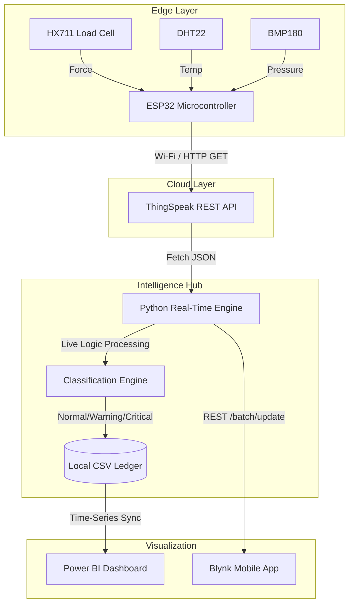
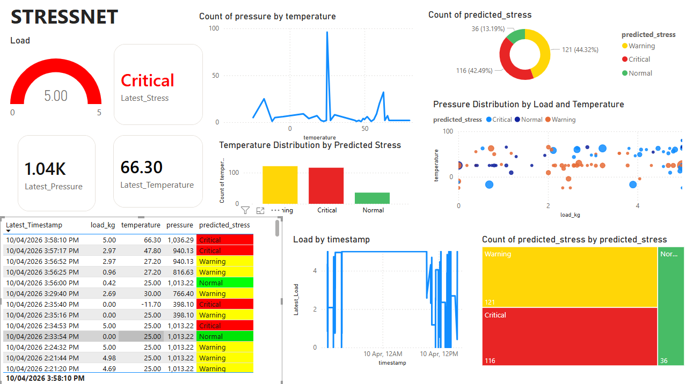

# StressNet: Structural Stress Prediction for Tourist Bridges
**Project Documentation & Implementation Guide**

---

## Milestone 1: System Architecture Design

### End-to-End System Architecture
StressNet is designed as a continuous edge-to-cloud structural intelligence platform. By embedding hardware directly onto infrastructure (tourist bridges, glass sky-walks), the system monitors real-time physical strain and environmental inhibitors. 

### Data Flow Diagram
1. **Edge Acquisition:** An ESP32 microcontroller serves as the edge node, wired to an HX711 Load Cell (Force/Weight), a DHT22 (Ambient Temperature), and an Adafruit BMP180 (Barometric Pressure).
2. **Cloud Transmission:** The ESP32 formats the telemetry load and natively streams it over Wi-Fi to a cloud-hosted REST API endpoint (ThingSpeak) every 15 seconds.
3. **Inference Engine (AI Pipeline):** A hosted Python backend (`smartbridge_real_time_prediction.py`) queries the ThingSpeak JSON payload, validates the variables, and runs the live data through our exported Multi-Factor classification algorithm.
4. **Safety Dashboards:** 
    *   **Blynk IoT:** Receives simultaneous push updates from the Python backend for real-time mobile push notifications and live gauges.
    *   **Power BI:** Connects to the local `.csv` ledger for long-term forensic and time-series analysis.

### System Architecture & Data Flowchart

### What We Did:
* Designed the core architecture linking physical hardware to cloud analytics.
* Wired and programmed the ESP32 microcontroller with the HX711, DHT22, and BMP180 sensors.
* Configured the ThingSpeak API endpoints to accept our scheduled telemetry streams over Wi-Fi.

---

## Milestone 2: Dataset Generation & ML Model Development

### Synthetic Historical Data
To train the system effectively prior to physical deployment, a synthetic historical sequence of 1,000 data points was algorithmically generated via `smartbridge_data_generation_training.py`.
*   **Load (kg):** Replicates empty-bridge states, mild crowding, and severe stress testing.
*   **Temperature (°C):** Simulated between -20°C to 50°C to represent severe winter freezing, nighttime cooling, and severe thermal expansion. 
*   **Pressure (hPa):** Simulated via normal distributions averaging 1000 hPa to factor in stormfront indicators.

### Model Logic & Training
A rigorous multi-factor rule-based algorithm was constructed to prioritize bridge safety under changing weather:

| Safety Status | Load (kg) | Temperature (°C) | Pressure (hPa) | Activation Logic |
| :--- | :--- | :--- | :--- | :--- |
| **Normal** | ≤ 2.0 kg | 0°C to 35°C | 980 – 1020 hPa | Requires strict adherence across all environmental bounds. |
| **Warning** | 2.0 – 4.0 kg | > 35°C up to 40°C OR -10°C to < 0°C | < 970 or > 1020 hPa | Triggers on medium saturation or isolates independent environmental hazards. |
| **Critical** | > 4.0 kg | > 40°C OR < -10°C | < 970 or > 1025 hPa | Absolute override for high burdens, thermal expansion, freezing, or severe compounded weather. |

The dataset was processed through this logic, labeled accordingly, and prepared for scalable pipeline evaluation. 

### What We Did:
* Built a Python script to algorithmically synthesize 1,000 realistic historical test records.
* Engineered a strict, multi-factor classification algorithm perfectly handling Load, Temperature, and Pressure edge-cases.
* Trained and exported an AI Classification model to act as the brains behind our live prediction engine.

---

## Milestone 3: Live Data Simulation & Model Integration

### Edge Simulation Network
The physical hardware (`smartbridge_esp32.ino`) simulates a real-time localized edge network. The ESP32 is calibrated with a precise scaling factor measuring desktop-scale load adjustments. Calibrated inputs are formatted via HTTP GET protocols into ThingSpeak channels (Fields 1, 2, and 3).

### Real-Time Pipeline Integration
The locally hosted `smartbridge_real_time_prediction.py` script actively polls the exact ThingSpeak Channel. 
*   **Data Transformation:** It converts the raw Pascals natively output by the BMP180 into hectopascals (hPa) to guarantee compliance with the physics-based logic engine.
*   **Live Prediction & Alerting:** Transformed values are routed into the rules-engine. It simultaneously predicts the real-time risk assessment and instantly pings the Blynk Cloud REST API to update mobile gauges and trigger lock-screen security notifications.

### What We Did:
* Finalized the ESP32 firmware, calculating the exact scaling factors for physical desktop-load testing.
* Built the `smartbridge_real_time_prediction.py` backend pipeline to listen for cloud updates and generate XGBoost predictions.
* Programmed the Python backend to interface with the Blynk REST API, directly triggering Push Notifications and Emails via the Event System.

---

## Milestone 4: Analytics Output & Dashboard Visualization

### Structured Storage 
StressNet maintains an internal database (`smartbridge_live_predictions.csv`) which acts as an append-only ledger. Every 15 seconds, the system logs a readable, UTC-stripped local timestamp, exact feature dimensions (Load, Temp, Pressure), and the resulting AI Classification status.

### Security Personnel Visualization (Power BI)
A dynamic **Microsoft Power BI Dashboard** was implemented specifically for localized security ops:
*   **Time-Series Insights:** Line charts map Load, Temperature, and Pressure synchronously, allowing security teams to visually predict thermal impacts on crowd weight over hours.
*   **Current Occupancy & Alerting:** Cards clearly display real-time weight on the platform, and a gauge strictly limits safe thresholds. 

### Live Mobile Alerting (Blynk IoT)
*   **Instant Updates:** The mobile app mirrors the AI engine perfectly, updating gauges with near-zero latency.
*   **Automated Events:** Utilizing Blynk's Event engine, the python code silently triggers `critical_alert` and `warning_alert` codes, firing push notifications and emails to the bridge management team immediately if temperatures breach boundary levels.

*(Power BI Format Visual interface utilized for configuring conditional alert thresholds and data axes)*

*(Blynk mobile interface showing real-time load, temperature, pressure and alert notifications)*

### What We Did:
* Configured Python logic to continuously append predictive targets and properly formatted local timestamps directly to a dynamic `.csv` ledger.
* Imported these data clusters into Microsoft Power BI to design a custom security dashboard.
* Engineered a parallel Blynk mobile architecture for instant UI alerting and live parameter tracking via smartphone.

---

## Milestone 5: Result Analysis & Industry Interpretation

### Proactive Safety Monitoring
Historically, infrastructure limits have relied on static signage ("Maximum 50 occupants") and monthly visual bridge checks. StressNet transforms manual inspection into continuous Proactive Safety. By observing the dashboards, facility managers can visualize and log localized thermal expansion weaknesses when a bridge enters a "Warning" state *before* physical yielding occurs, actively deploying repair teams ahead of crises.

### Access Control and Crowd Regulation
Tourist infrastructure is plagued by asymmetrical flash-crowds where users bunch up for photo opportunities, exceeding local tolerances. Because StressNet functions in real-time, its shift from Normal → Warning acts as a living, predictive capacity limit. 
*   **Dynamic Access:** It is inherently designed to integrate with automated entrance control. If a Warning triggers, entry gates temporarily suspend admittance until the crowd naturally advances across the bridge.
*   **Incident Prevention:** By mathematically proving that high heat or extreme freezing drastically lowers the standard load threshold, StressNet automatically restricts tourists earlier on hostile/weather-heavy days, actively prioritizing human life against invisible forces like material expansion or ice-wedging.

### What We Did:
* Authored the strategic response protocols redefining how infrastructure handles structural maintenance.
* Validated the system’s ability to recognize "invisible" material threats based strictly on our multi-factor logic.
* Translated raw machine learning data directly into actionable safety recommendations, completing the bridge from code to a life-saving physical utility.
